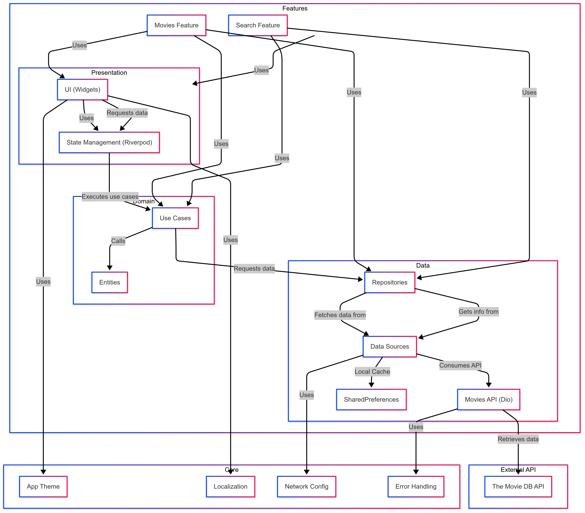

# 🎬 Cinemania

## 📌 Overview
This project is a Flutter application that lists the most popular movies using TheMovieDB API.

## 🚀 Features
- [X]List popular movies
- []Search movies
- []Pagination support
- []Multi-language support (EN, ES)
- []Dark mode

## 🏗️ Architecture Diagram


For a detailed view of the architecture in **Mermaid format**, see [architecture_diagram.mmd](docs/architecture_diagram.mmd).

## 🔧 Installation & Setup
1. Clone the repository:
   ```sh
   git clone https://github.com/javikin/cinemania.git
   ```
2. Install dependencies:
   ```sh
   flutter pub get
   ```
3. Run the application:
   ```sh
   flutter run
   ```

## 📄 License
This project is open-source under the MIT License.
